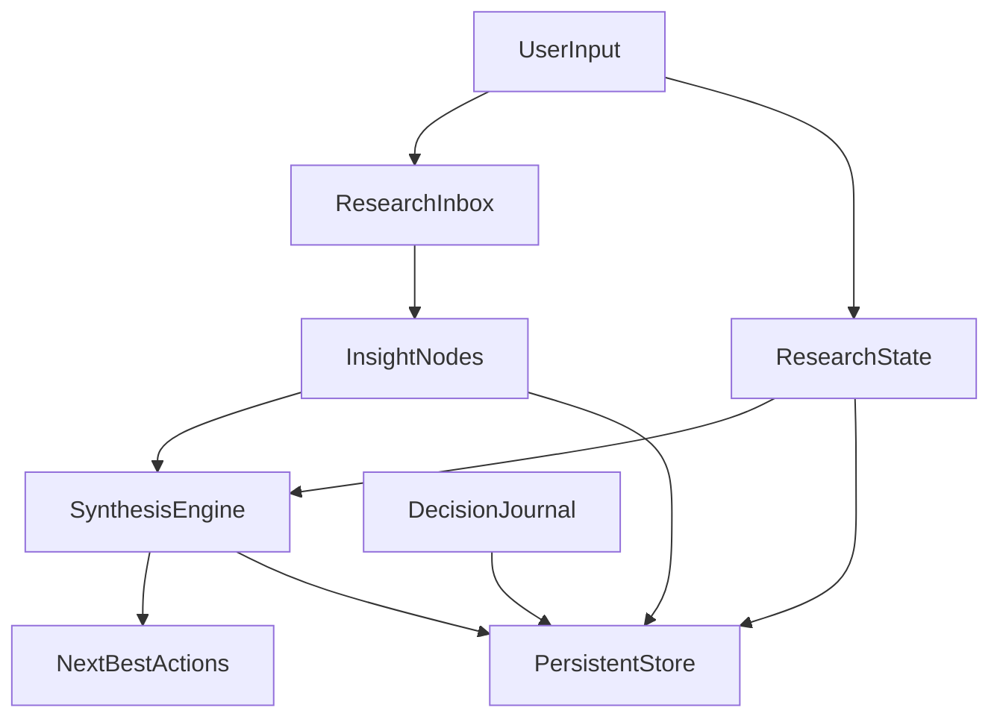

# Personal AI Research OS

Most AI systems optimize **information retrieval** and **summarization**.

This project explores a harder problem:
**How do we prevent reasoning collapse during complex research and problem‑solving workflows?**

When a research thread gets long, synthesis becomes expensive: uncertainty piles up, assumptions drift, decisions get lost, and you end up re-thinking the same paths. The result is **synthesis fatigue** and **reasoning discontinuity**.

**Personal AI Research OS** is a *reasoning workflow system* focused on:
- **Reasoning continuity**: keep the exploration state coherent over time.
- **Uncertainty tracking**: make unknowns explicit and actionable.
- **Decision traceability**: preserve what you decided and why.
- **Synthesis support**: compress complexity into next-best actions without “replacing thinking”.

## What it outputs (product contract)
Given a research/problem-solving prompt, the OS aims to maintain a persistent state and produce:
- **ResearchState** (current goal, knowns/unknowns, assumptions, constraints, candidate paths, blockers, confidence)
- **Unknowns** (severity, blocking degree, proposed resolution)
- **DecisionJournal** (decision + rationale + tradeoffs + revisit conditions)
- **InsightNodes** (inbox items transformed into structured claims + relevance + open questions)
- **SynthesisSummary** (themes, risk hotspots, divergence warnings, next-best actions)

## Why existing tools fail
Chat + RAG tools are great at *one-shot answers*, but they struggle when:
- the problem is ambiguous and requires iterative framing,
- the workflow branches into multiple candidate paths,
- you need to revisit earlier decisions after new evidence arrives,
- you need to keep uncertainty visible instead of “papering over” it with fluent text.

They don’t preserve the *shape* of your reasoning. This OS does.

## Architecture (MVP)



## Quickstart (new product)
This repo is being refactored into a **TypeScript + Postgres (Supabase)** product with a single web entrypoint.

- **Prereqs**: Node 18+, a Supabase Postgres project, and a `DATABASE_URL`.
- **Env**: set `DATABASE_URL` in `.env` (see `.env.example`).

### Local DB (Docker) — recommended for demo
Start Postgres locally:

```bash
docker compose up -d
```

Copy `.env.example` → `.env` and keep the provided local `DATABASE_URL`.

### Run
Install dependencies:

```bash
npm install
```

Generate Prisma client + run migrations (requires a reachable Postgres via `DATABASE_URL`):

```bash
npm run prisma:generate
npm run db:migrate
```

Start the web app:

```bash
npm run dev
```

Optional: seed a demo session:

```bash
npm run seed
```

## Workflow examples

### Example: “Improve RAG retrieval quality for internal docs”
The OS should help you:
- keep a stable **problem framing** (what “quality” means: recall@k, answer groundedness, latency),
- track **unknowns** (dataset quality, ACL behavior, chunking policy, eval harness),
- journal decisions (BM25+dense fusion vs dense-only; reranker tradeoffs),
- produce a synthesis that says things like:
  - “You are repeatedly exploring retrieval vs reranking; define an evaluation set before tuning.”
  - “Highest-risk assumption: relevance labels represent your real user distribution.”
  - “Next action: build a 200-query eval set + run ablations: chunk size, hybrid weights, reranker on/off.”

## Repo structure (target)
- `apps/` (web product entrypoint)
- `packages/` (reasoning, synthesis, memory, uncertainty modules)
- `docs/` (philosophy, architecture, workflows, prompts)

## Legacy demos (still available)
This repo also contains earlier Python-first research/benchmark demos (kept runnable while the new product is built):

```bash
pip install -r requirements.txt

# Enterprise pipeline UI
streamlit run 09_apps/streamlit_ui.py

# Benchmark dashboard
streamlit run 09_apps/benchmark_dashboard.py

# SOTA radar
streamlit run 09_apps/sota_radar_dashboard.py

# IR experiment dashboard
streamlit run ui/app.py
```

## License
Released under the [MIT License](LICENSE).
