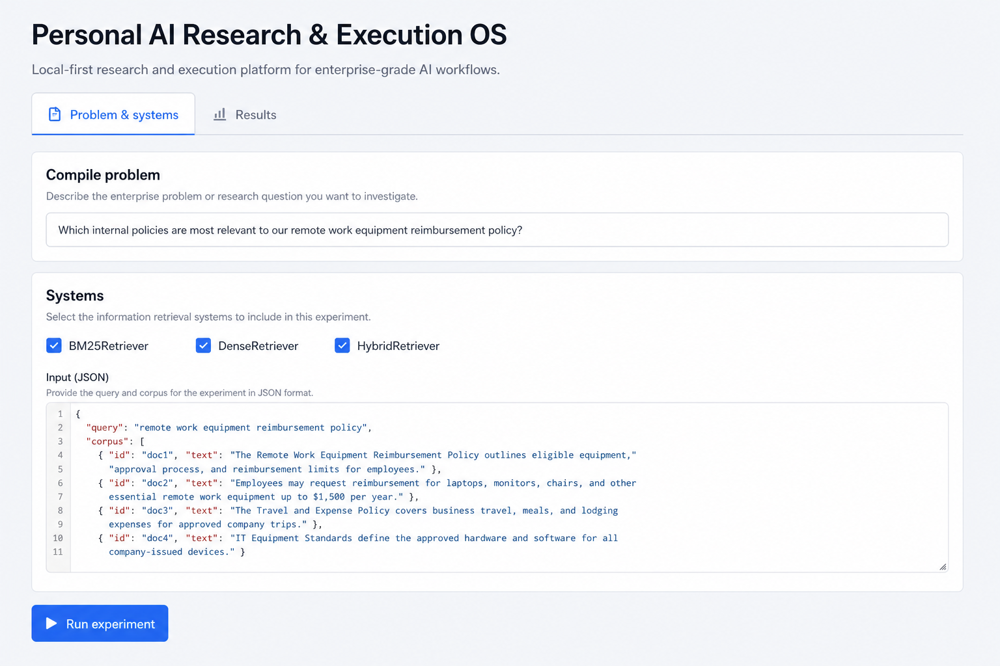

# Personal AI Research & Execution OS

Local-first Python toolkit for turning **customer problems → structured research tasks → multi-system experiments → evaluation → insights → durable memory**. It is built for a single advanced operator (architect, researcher, FDE-style execution), not as a SaaS product.

## Principles

- **One interface for every system:** `AISystem.run(input: dict) -> SystemOutput` for retrieval, LLM/RAG, multimodal, agents, and business models.
- **Reproducible runs:** seeded experiments, JSONL logs, SQLite memory.
- **No SaaS requirement:** metrics, local judge proxies, and template QA run without external APIs (you can swap in your own models later).

## Screenshot

Streamlit dashboard (`ui/app.py`): compile a problem, pick systems, paste JSON input, then review results in the second tab.



*Preview image aligned with the current Streamlit layout; replace with your own capture if you prefer a literal runtime screenshot.*

## Layout

| Path | Purpose |
|------|---------|
| `problem_compiler/` | Natural language → structured task (domain, hypotheses, suggested systems). |
| `system_registry/` | `AISystem` implementations and registry. |
| `experiment_engine/` | Run the same input across selected systems; append-only logs under `data/logs/`. |
| `evaluation_engine/` | Recall@k, MRR, nDCG@k, accuracy-style checks, local judge dimensions, pairwise comparisons. |
| `insight_engine/` | Research-style narrative: best system, ranking, hypotheses, next steps, failure hooks. |
| `memory/` | SQLite store for experiments, evaluations, insights, failures, and performance history. |
| `ui/` | Streamlit dashboard for fast iteration. |
| `main.py` | CLI demo of the full pipeline. |

## Requirements

- **Python 3.10+** (3.10–3.12 recommended for `torch` / `sentence-transformers` stability).

## Install

From the directory that **contains** this folder (if this repo is named `research_os` inside a parent project):

```bash
pip install -r research_os/requirements.txt
```

If you cloned this repo so that **this folder is your project root** (this README sits next to `main.py`):

```bash
pip install -r requirements.txt
```

## Run

**CLI (one-shot pipeline):**

```bash
# From parent of the `research_os` package folder:
python research_os/main.py --systems BM25Retriever DenseRetriever HybridRetriever

# From inside this folder (when this folder is the repo root):
python main.py --systems BM25Retriever DenseRetriever HybridRetriever
```

**Streamlit UI:**

```bash
streamlit run research_os/ui/app.py
# or, from repo root that matches this tree:
streamlit run ui/app.py
```

Use the **Problem & systems** tab to compile a problem, pick systems, paste JSON input (IR-style: `query`, `corpus`, optional `relevant_ids`, `top_k`), then run. Open **Results** for tables, pairwise output, insights, and failure snapshots.

## Input hints

- **IR-style systems** expect keys like `query`, `corpus` (`[{ "id", "text" }]`), optional `relevant_ids` for metrics, and `top_k`.
- **LLM/RAG** expect `question` and usually `corpus` for `RAGSystem`.
- **Agents** expect `task` (and optional `tools`).
- **Business** models expect their documented keys (`candidates`, `rows`, `catalog`, etc.)—see `system_registry/systems/`.

## Adding a system

1. Subclass `AISystem` in `system_registry/systems/`.
2. Register in `get_default_registry()` in `system_registry/registry.py`.
3. Optionally extend `ProblemCompiler` so new systems appear in `suggested_systems`.

## License

Use and modify for personal or internal research. Add a license file if you redistribute.
